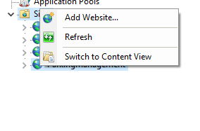

# Parking-Managment

# Process to host the project

### Open IIS manager
### Right Click on Site Folder and click Add Website  
  
### A dialog box will appear as shown below write the site name,in physical path select the path of your project that is parkingmanagement.web
### Write hostname and click OK.  
  
### On right side click bindings and add https type with port 443 and ssl certificate  
  
  

### After that go to C:\Windows\System32\drivers\etc and edit host file and add ip and website name there and save it as shown below.  
  

### Now you can browse the project from your given url.

# Initialize Process
### On clicking the initialize button it sends a ajax call to a web method which then connects the database and then it first clears all transactional record then clear parking space after that it clears all the parking zone from the database and then reseeds the identity of tables to 1 after that it re-initialize the no of zone to three named as A,B,C and each zone consiting of 10 parking Space named A01,A02,B01 ...etc.   

